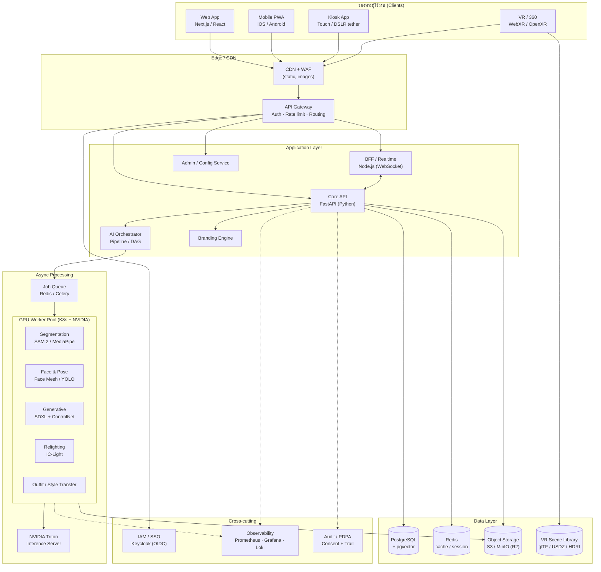
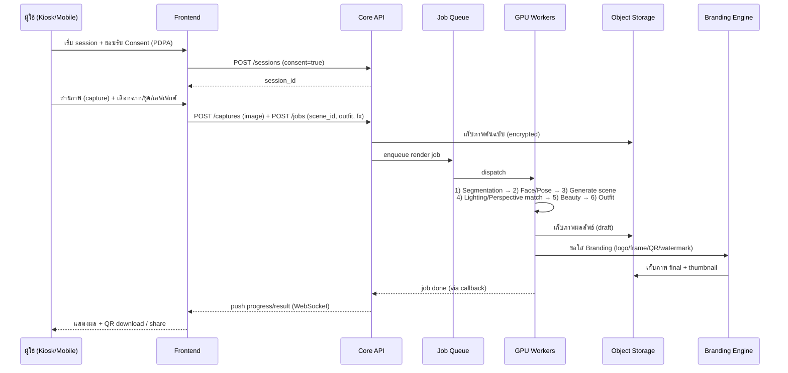

# 1. System Architecture — PSRU AI Virtual Photo Booth & VR Studio

## 1.1 หลักการออกแบบ (Design Principles)

- **Edge-first capture, cloud-heavy generation** — งานเบา (segmentation preview, face/pose) ทำได้บนอุปกรณ์/edge; งานหนัก (diffusion, relighting) ทำบน GPU cluster
- **Event-driven & async** — การประมวลผล AI เป็น job แบบ queue เพื่อรองรับช่วง peak (วันรับปริญญา)
- **Stateless services + shared object storage** — ขยายแนวนอนได้, รูปทุกชิ้นอยู่บน Object Storage
- **Privacy by design (PDPA)** — consent gate ก่อนเก็บข้อมูลชีวมิติ, TTL, สิทธิ์ลบ
- **Multi-channel** — Web, Mobile (PWA), Kiosk, VR/360 ใช้ API/Design System ชุดเดียวกัน

## 1.2 แผนภาพสถาปัตยกรรมระดับสูง (C4 — Container View)

## 1.3 ส่วนประกอบหลัก (Component Responsibilities)

| ส่วนประกอบ | หน้าที่ | เทคโนโลยี |
|------------|---------|-----------|
| **API Gateway** | Auth, rate limiting, routing, TLS termination | Kong / Traefik |
| **Core API** | Sessions, captures, scenes, jobs, output, stats | FastAPI |
| **BFF / Realtime** | Live preview, job progress (WebSocket/SSE), kiosk pairing | Node.js |
| **AI Orchestrator** | จัด pipeline เป็น DAG, retry, fallback model | Python (Celery + custom DAG) |
| **GPU Worker Pool** | Inference จริง (segment, face, generate, relight, outfit) | PyTorch + Triton |
| **Branding Engine** | ใส่โลโก้/กรอบ/QR/ลายน้ำ/หมายเลขภาพ | Python (Pillow/Skia) + template |
| **Admin/Config** | จัดการฉาก, template, prompt, RBAC, event | FastAPI + React Admin |
| **IAM/SSO** | OIDC, MFA, RBAC | Keycloak |
| **Object Storage** | ภาพต้นฉบับ/ผลลัพธ์, HDRI, asset 3D | S3 / MinIO / Cloudflare R2 |

## 1.4 ลำดับการทำงานหลัก (Capture → Output Sequence)

## 1.5 รูปแบบการ Deploy (Topologies)

1. **On-Prem GPU (มหาวิทยาลัย)** — ใช้ GPU server ของมหาวิทยาลัย, ข้อมูลไม่ออกนอกองค์กร (เหมาะกับ PDPA สูงสุด)
2. **Hybrid** — แอป/ฐานข้อมูลบน cloud, inference หนักบน GPU on-prem หรือ GPU cloud ตามโหลด
3. **Event Burst (Cloud GPU)** — เช่าสปอต GPU เฉพาะช่วงงานใหญ่ (วันรับปริญญา) แล้ว scale-to-zero

ดู [`07-deployment-architecture.md`](07-deployment-architecture.md) สำหรับรายละเอียด Kubernetes/Helm

## 1.6 มาตรฐานช่องทาง (Channel Notes)

- **Web/Mobile (PWA):** offline shell, camera API, ติดตั้งบนหน้าจอหลักได้, push notification เมื่อภาพเสร็จ
- **Kiosk:** โหมดเต็มจอ, ล็อกระบบ (kiosk lockdown), รองรับ DSLR/Mirrorless tether (gPhoto2/SDK), auto-reset session, ปุ่มใหญ่เหมาะ touch
- **VR/360:** WebXR สำหรับ walkthrough ฉาก, OpenXR สำหรับ headset; asset จาก VR Scene Library
