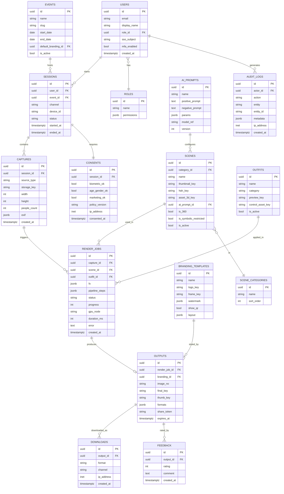

# 2. Database Design & ER Diagram

ฐานข้อมูลหลัก: **PostgreSQL 16** (+ `pgvector` สำหรับ face/scene embedding, semantic search ฉาก)
Cache/realtime: **Redis** · ไฟล์รูป/asset: **Object Storage** (เก็บเฉพาะ key/URL ใน DB)

## 2.1 ER Diagram

## 2.2 ตารางสำคัญ & เหตุผลการออกแบบ

| ตาราง | บทบาท | หมายเหตุการออกแบบ |
|-------|-------|--------------------|
| `sessions` | หนึ่งครั้งที่ผู้ใช้มาใช้บูธ | `channel` = web/mobile/kiosk/vr; auto-expire |
| `consents` | บันทึกความยินยอม PDPA แยกราย scope | แยก biometric / age-gender / marketing เพื่อ granular consent |
| `captures` | ภาพต้นฉบับ | เก็บแค่ `storage_key`; ตั้ง TTL ลบอัตโนมัติ |
| `render_jobs` | งาน AI แต่ละชิ้น | `pipeline_steps` jsonb เก็บผลแต่ละ stage เพื่อ debug/retry |
| `scenes` | ฉากเสมือน | `is_symbolic_restricted` กัน guardrail ฉากเชิงสัญลักษณ์ |
| `outputs` | ภาพ final + branding | `share_token` + `expires_at` สำหรับ QR/ลิงก์ดาวน์โหลดมีอายุ |
| `audit_logs` | ตรวจสอบย้อนกลับ | append-only, ใช้ทำ Audit Trail (PDPA/RBAC) |

## 2.3 ดัชนีและประสิทธิภาพ (Indexing)

- `render_jobs(status, created_at)` — สำหรับ worker poll + dashboard queue depth
- `outputs(share_token)` UNIQUE — lookup ดาวน์โหลดเร็ว
- `sessions(event_id, started_at)` — รายงานตาม event
- `scenes USING ivfflat (embedding vector_cosine_ops)` — ค้นหา/แนะนำฉากเชิงความหมาย
- Partitioning `audit_logs` และ `downloads` แบบ monthly (range on `created_at`)

## 2.4 นโยบายเก็บรักษาข้อมูล (Retention / PDPA)

| ข้อมูล | ค่าเริ่มต้น | กลไก |
|--------|-------------|------|
| `captures` (ภาพต้นฉบับ) | ลบใน 24 ชม. หลัง render | cron + object lifecycle rule |
| `outputs` (ภาพ final) | 30 วัน (หรือจนสิ้นสุด event) | `expires_at` + lifecycle |
| ข้อมูลชีวมิติ (embedding) | ไม่เก็บถาวร เว้นแต่ยินยอม | ผูกกับ `consents.biometric_ok` |
| `audit_logs` | 1–2 ปี | partition + archive |

> สคีมาเต็มอยู่ใน [`../schema.sql`](../schema.sql) (รวม trigger, index, lifecycle helper)
