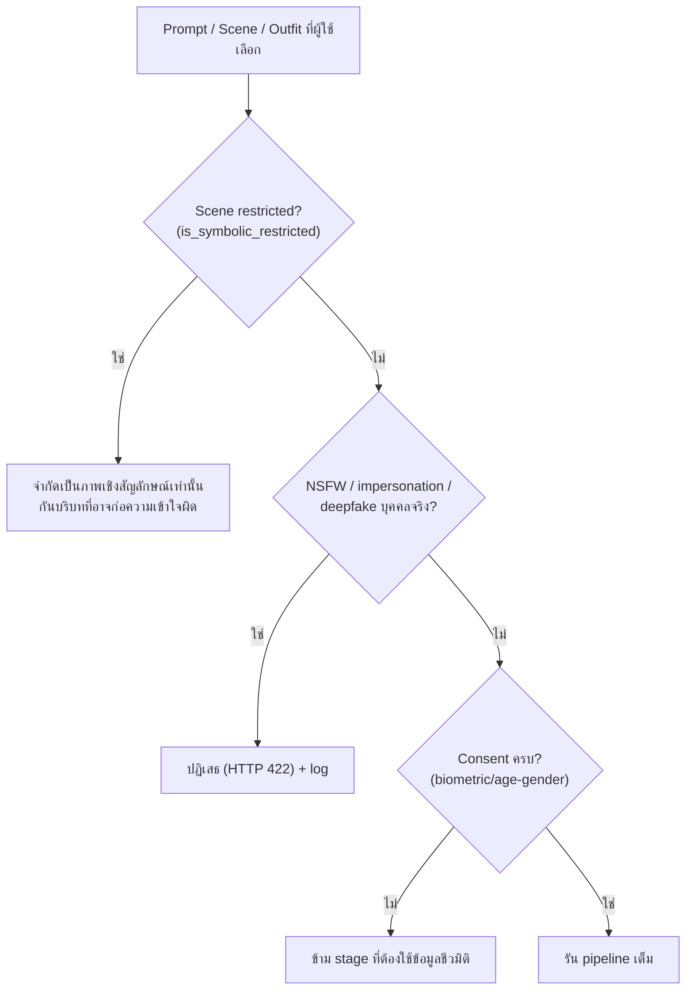

# 4. AI Workflow Diagram & Pipeline

Pipeline ของ AI Orchestrator เป็น **DAG** ที่ประมวลผลบน GPU Worker Pool
แต่ละ stage บันทึกผลลง `render_jobs.pipeline_steps` เพื่อ retry/debug และมี **fallback model**

## 4.1 12 Steps → AI Pipeline

```mermaid
flowchart LR
    A["STEP1<br/>Capture<br/>(webcam/DSLR/mobile)"] --> B["STEP2<br/>Human Segmentation<br/>SAM 2 + MediaPipe (hair matting)"]
    B --> C["STEP3<br/>Face Recognition<br/>Face Mesh (consent-gated)"]
    C --> D["STEP4<br/>Pose Estimation<br/>MediaPipe Pose / YOLO-pose"]
    D --> E["STEP6+7+8<br/>Virtual Scene + Lighting + Perspective<br/>SDXL + ControlNet(depth/pose) + IC-Light"]
    E --> F["STEP9<br/>Generative FX<br/>snow/rain/confetti/sunset"]
    F --> G["STEP10<br/>AI Outfit<br/>IP-Adapter / inpaint + ControlNet"]
    G --> H["STEP5<br/>Beauty Enhance<br/>denoise · retouch · WB · HDR"]
    H --> I["STEP11<br/>Branding Engine<br/>logo · frame · QR · watermark · image no."]
    I --> J["STEP12<br/>Output<br/>JPG/PNG/TIFF/PDF · QR · Cloud Gallery"]
```

> หมายเหตุลำดับ: STEP5 (Beauty) ทำ **หลัง** การ compose ฉาก/ชุด เพื่อให้สี/แสงกลืนทั้งภาพ
> ส่วน Lighting (7) + Perspective (8) ถูกผูกเข้ากับขั้น generate (6) ผ่าน ControlNet + HDRI relighting

## 4.2 รายละเอียดแต่ละ Stage

| Stage | โมเดลหลัก | Fallback | อินพุต → เอาต์พุต |
|-------|-----------|----------|--------------------|
| Segmentation | **SAM 2** + MediaPipe Selfie/Hair matting | RVM (RobustVideoMatting) | ภาพ → alpha matte (ผม/ขอบโปร่งใส, หลายคน) |
| Face | **Face Mesh** (468 จุด) | RetinaFace | matte → landmarks, gaze, smile (เก็บต่อเมื่อ consent) |
| Pose | **MediaPipe Pose** / YOLOv8-pose | OpenPose | → keypoints, แนะนำท่าทาง |
| Scene Generate | **SDXL** + ControlNet (depth+pose) | SD 1.5 + ControlNet | matte + scene prompt → composited image |
| Relighting | **IC-Light** (HDRI-driven) | Manual LUT/gamma | จับทิศแสง/เงา/ambient ให้ตรงฉาก |
| Perspective | Depth-aware warp (Depth-Anything) | Affine scale | จัดขนาดตัว/มุม/ความลึก/lens |
| FX | Diffusion inpaint + particle overlay | Pre-rendered PNG overlay | เพิ่มหิมะ/ฝน/พลุ/confetti |
| Outfit | **IP-Adapter** + inpaint + ControlNet(pose) | Garment warp (TPS) | เปลี่ยนชุดครุย/สูท/ไทย/นักศึกษา |
| Beauty | GFPGAN/CodeFormer (restore) + auto WB/HDR | bilateral + curve | รีทัชธรรมชาติ, ลด noise, คมชัด |
| Branding | Skia/Pillow compositor | — | ใส่ logo/frame/QR/watermark/หมายเลข |

## 4.3 Performance / Scaling

- **เป้าหมาย latency:** ภาพเดี่ยว ≤ 8–12 วินาที (warm GPU), batch หมู่ ≤ 20 วินาที
- **Serving:** NVIDIA **Triton** + model ensemble, TensorRT/`fp16`, dynamic batching
- **Caching:** ฉาก/HDRI/asset โหลดล่วงหน้าใน worker; seed คงที่ต่อ event เพื่อความสม่ำเสมอของแบรนด์
- **Autoscaling:** KEDA scale ตาม queue depth ของ Redis; spot GPU สำหรับช่วง burst

## 4.4 AI Guardrails (สำคัญ)

- ไม่สร้างภาพ **เลียนแบบบุคคลจริง** ที่ไม่ใช่ผู้ใช้ (ป้องกัน deepfake)
- ฉากเชิงสัญลักษณ์ (เช่น พระราชวัง) ใช้เพื่อเกียรติยศ/ประชาสัมพันธ์ มี watermark กำกับ
- ทุกภาพมี **ลายน้ำ + เมทาดาทา "AI-generated"** เพื่อความโปร่งใส
- การวิเคราะห์เพศ/อายุทำเฉพาะเมื่อยินยอม และไม่ใช้ตัดสินใจที่กระทบสิทธิ์
