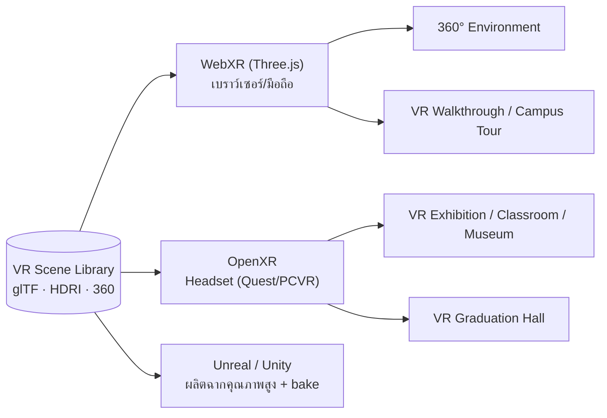

# 5. VR Scene Library

คลังฉากเสมือนใช้ทั้งใน **2D compositing** (พื้นหลังภาพถ่าย) และ **VR/360 walkthrough**
แต่ละฉากมีชุด asset: HDRI (relighting), thumbnail, prompt ของ Generative AI และ asset 3D (glTF/USDZ)

## 5.1 โครงสร้าง Asset ต่อฉาก

```
scene/{slug}/
├── thumbnail.webp        # การ์ดเลือกฉาก (UI)
├── env.hdr               # HDRI สำหรับ IC-Light relighting + IBL ใน VR
├── prompt.json          # positive/negative prompt + params (อ้างถึง ai_prompts)
├── scene.gltf / .usdz    # โมเดล 3D สำหรับ WebXR / OpenXR (ถ้ามี)
├── pano_360.ktx2         # ภาพ 360° (equirectangular, บีบอัด)
└── meta.json            # license, is_360, is_symbolic_restricted, category
```

## 5.2 รายการฉาก (Scene Catalog)

| หมวด | ฉาก | 360/VR | หมายเหตุ |
|------|-----|:------:|----------|
| PSRU Campus | หอประชุมศรีวชิรโชติ | ✅ | ฉากเรือธงพิธีการ |
| PSRU Campus | อาคารเรียน PSRU | ✅ | Campus tour |
| พิธีการ | พิธีพระราชทานปริญญาบัตร | — | ใช้คู่ชุดครุย, มี guardrail บริบท |
| พิธีการ | ห้องรับรอง VIP | ✅ | ภาพผู้บริหาร/แขก |
| Academic | ห้องประชุมผู้บริหาร | ✅ | — |
| Academic | ห้องเรียนอัจฉริยะ | ✅ | VR Classroom |
| Academic | ห้องสมุดดิจิทัล | ✅ | VR Museum/Library |
| Academic | Co-working Space | — | — |
| Academic | เวทีประชุมวิชาการ | ✅ | VR Exhibition |
| Studio | สตูดิโอข่าว | — | ฉากผู้ประกาศ |
| Future | เมืองอนาคต | ✅ | Sci-fi |
| Future | อวกาศ | ✅ | — |
| Nature | ธรรมชาติ (สวน/ภูเขา/ทะเล) | ✅ | FX พระอาทิตย์ตก/หิมะ |
| Heritage | พิพิธภัณฑ์ | ✅ | VR Museum |
| Heritage | พระราชวัง (เชิงสัญลักษณ์) | — | `is_symbolic_restricted = true` |
| Heritage | วัดไทย | ✅ | — |
| Heritage | เมืองโบราณ | ✅ | — |

## 5.3 VR Modes



- **360° Environment** — ดูฉากแบบ panorama จากภาพถ่าย/เรนเดอร์ (ใช้ `pano_360.ktx2`)
- **VR Walkthrough / Campus Tour** — เดินสำรวจฉาก 3D, ใช้ glTF + IBL จาก HDRI
- **VR Exhibition / Classroom / Museum / Graduation Hall** — ฉากเฉพาะกิจกรรม รองรับ headset

## 5.4 Pipeline การผลิตฉาก (Authoring)

1. **Capture/Build** — ถ่ายภาพจริง 360 (PSRU) หรือสร้างใน Unreal/Unity
2. **Bake** — แสง/เงา bake เป็น HDRI + lightmap, export glTF/USDZ + KTX2
3. **Optimize** — Draco/Meshopt compression, LOD, texture ≤ 2K สำหรับ web
4. **Register** — เพิ่มลงตาราง `scenes` + ผูก `ai_prompts` + ตั้ง flag (360/restricted)
5. **QA** — ทดสอบ relighting กับภาพคนจริง + ตรวจ guardrail ฉากเชิงสัญลักษณ์

## 5.5 มาตรฐานเทคนิค

| รายการ | ค่ามาตรฐาน |
|--------|-----------|
| รูปแบบ 3D | glTF 2.0 (web), USDZ (iOS AR) |
| Texture compression | KTX2 / Basis Universal |
| HDRI | `.hdr` / `.exr`, 2K–4K |
| Panorama | equirectangular 4K–8K, KTX2 |
| Mesh budget (web) | ≤ 150k tris/scene, LOD 3 ระดับ |
| Standard | OpenXR (headset), WebXR (browser) |
