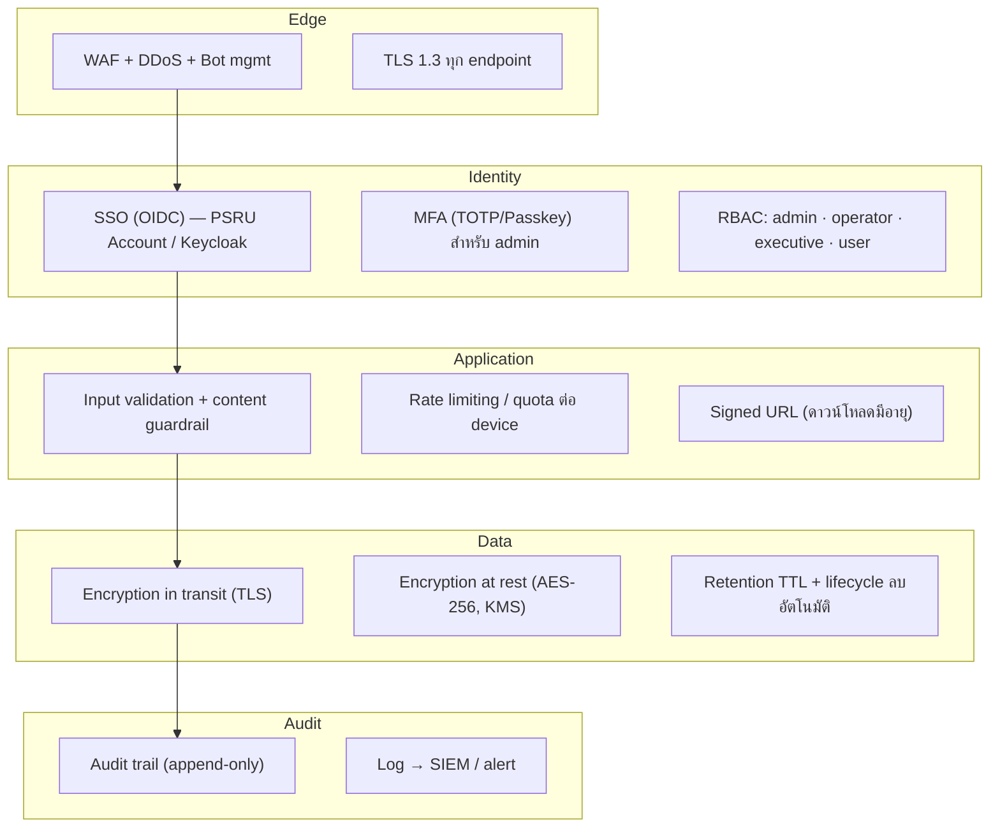

# 6. Security Architecture & PDPA Compliance

## 6.1 หลักการ (Defense in Depth)

## 6.2 Authentication & Authorization

| ผู้ใช้ | วิธียืนยันตัวตน | สิทธิ์ (RBAC) |
|--------|------------------|---------------|
| Admin | SSO + **MFA บังคับ** | จัดการฉาก/แบรนด์/prompt/users/event + audit |
| Operator (เจ้าหน้าที่บูธ) | SSO | จัดการ session/capture/output ของงาน |
| Executive | SSO | อ่าน dashboard/report เท่านั้น |
| User/Guest | Kiosk device token / SSO เลือกได้ | ใช้บูธ + เข้าถึงภาพของตนเอง |

- **OIDC** ผ่าน Keycloak เชื่อม PSRU Account; JWT อายุสั้น + refresh token
- **Kiosk** ใช้ device-bound token (หมุนเวียน), ล็อกเครื่องแบบ kiosk lockdown
- **RBAC** ตรวจที่ API Gateway + service ระดับ permission key (จาก `roles.permissions`)

> **สถานะการพัฒนา:** ใช้งานจริงแล้วใน backend (`app/security.py`) — validate RS256 ผ่าน Keycloak
> JWKS เมื่อตั้ง `OIDC_ISSUER` (อ่าน role จาก `realm_access.roles`) และมี dev-mode (HS256) สำหรับรัน/เทสต์
> โดยไม่ต้องมี Keycloak · บังคับ RBAC: kiosk สาธารณะ · `/stats/*`=executive · `/admin/*`=admin ·
> มี realm import (`backend/keycloak/realm-export.json`) + ผู้ใช้เดโม · **ยังเหลือบังคับ MFA สำหรับ admin**

## 6.3 PDPA Compliance (พ.ร.บ.คุ้มครองข้อมูลส่วนบุคคล)

| หลักการ PDPA | การปฏิบัติในระบบ |
|---------------|-------------------|
| **ความยินยอม (Consent)** | Consent gate ก่อนเก็บ/ใช้ภาพ; แยก scope (ชีวมิติ / อายุ-เพศ / การตลาด); บันทึก `policy_version`, IP, เวลา |
| **เก็บเท่าที่จำเป็น (Minimization)** | เก็บเฉพาะ key ของไฟล์; ไม่เก็บ embedding ชีวมิติถาวรเว้นแต่ยินยอม |
| **กำหนดอายุ (Storage limitation)** | ภาพต้นฉบับลบใน 24 ชม., ภาพ final 30 วัน (ตั้งค่าได้ต่อ event) |
| **สิทธิ์เจ้าของข้อมูล** | ขอเข้าถึง/ลบภาพของตนเองผ่าน share token หรือเจ้าหน้าที่ |
| **ความมั่นคงปลอดภัย** | เข้ารหัส at rest/in transit, access control, audit |
| **ความโปร่งใส** | ลายน้ำ + เมทาดาทา "AI-generated" บนทุกภาพ |
| **DPO/แจ้งเหตุละเมิด** | กระบวนการแจ้งเหตุภายใน 72 ชม. + log สำหรับสืบสวน |

## 6.4 Data Protection

- **At rest:** AES-256 (Object Storage + DB) คีย์จัดการผ่าน KMS/Vault, หมุนเวียนคีย์
- **In transit:** TLS 1.3, HSTS, certificate pinning สำหรับ kiosk
- **Secrets:** เก็บใน Vault/Sealed Secrets, ไม่ฝังในโค้ด/repo
- **Watermark:** มองเห็นได้ (logo/ข้อความ) + invisible watermark (steganographic) เพื่อพิสูจน์ที่มา
- **Signed URL:** ดาวน์โหลดผ่าน CDN ด้วย URL มีอายุ ป้องกัน hotlink/leak

## 6.5 Audit Trail

- ทุก action สำคัญ (login, แก้ฉาก/prompt, ลบ output, export) ลง `audit_logs` (append-only)
- ส่งต่อ SIEM, ตั้ง alert พฤติกรรมผิดปกติ (เช่น ดาวน์โหลดจำนวนมากผิดปกติ)
- รายงาน audit ให้ผู้บริหาร/DPO ตรวจสอบได้ผ่าน Admin Console

## 6.6 Threat Model (สรุป STRIDE)

| ภัย | ตัวอย่าง | การควบคุม |
|-----|---------|-----------|
| Spoofing | ปลอม kiosk/token | Device-bound token + mTLS |
| Tampering | แก้ภาพ/แบรนด์ | Signed asset + audit + invisible watermark |
| Repudiation | ปฏิเสธการกระทำ | Audit trail append-only |
| Info disclosure | ภาพรั่ว | Signed URL, encryption, RBAC, TTL |
| DoS | ถล่ม render queue | Rate limit, quota, queue cap, autoscale |
| Elevation | ยกระดับสิทธิ์ | RBAC least-privilege, MFA admin |
| **Misuse (AI)** | deepfake/ฉากไม่เหมาะสม | Content guardrail (ดู AI Workflow §4.4) |
