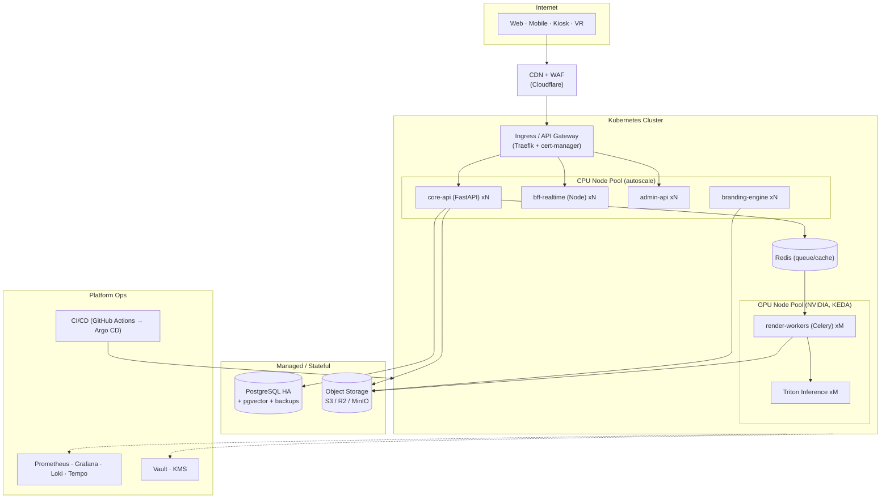
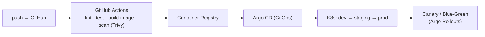

# 7. Deployment Architecture

## 7.1 ภาพรวม (Kubernetes + GPU)

## 7.2 Environments

| Env | วัตถุประสงค์ | GPU |
|-----|--------------|-----|
| `dev` | พัฒนา/ทดสอบ pipeline | 1 GPU (shared, MIG) |
| `staging` | UAT + load test ก่อนงานจริง | 1–2 GPU |
| `prod` | งานจริง/อีเวนต์ | 2–8 GPU (autoscale + spot burst) |

## 7.3 กลยุทธ์ Scaling

- **CPU services:** HPA ตาม CPU/req latency
- **GPU workers:** **KEDA** scale ตาม **Redis queue depth** (เป้าหมาย: เวลา wait < 15 วินาที)
- **Event burst:** เปิด node pool spot GPU ล่วงหน้าก่อนงานใหญ่ (วันรับปริญญา) แล้ว scale-to-zero หลังจบ
- **Model serving:** Triton ใช้ dynamic batching + model instance หลายตัวต่อ GPU (MIG/MPS)

## 7.4 CI/CD & GitOps

- Build แยก image: `core-api`, `bff`, `render-worker` (CUDA base), `branding`, `admin`, `web`
- Image scan (Trivy) + SBOM; deploy แบบ canary; rollback อัตโนมัติเมื่อ metric เกิน threshold

## 7.5 Resilience / DR

| ด้าน | แนวทาง |
|------|--------|
| Database | PostgreSQL HA (primary+replica) + PITR backup รายวัน |
| Object Storage | versioning + cross-region replication (สำหรับภาพสำคัญ) |
| Queue | Redis persistence + dead-letter queue สำหรับ job ที่ fail |
| Stateless services | หลาย replica + PodDisruptionBudget |
| RTO / RPO | RTO ≤ 4 ชม., RPO ≤ 15 นาที |
| Backup test | กู้คืนทดสอบทุกไตรมาส |

## 7.6 ทางเลือก Topology

1. **On-Prem GPU (มหาวิทยาลัย)** — เหมาะ PDPA สูงสุด, ข้อมูลอยู่ในองค์กร
2. **Hybrid** — แอป/DB บน cloud, GPU on-prem หรือ cloud ตามโหลด (ใช้ Hyperdrive/VPN เชื่อม)
3. **Full Cloud (burst)** — เช่า GPU cloud เฉพาะอีเวนต์ คุมต้นทุนด้วย scale-to-zero

> สำหรับ PoC/อีเวนต์ขนาดเล็ก สามารถเริ่มแบบ single-node (docker-compose + 1 GPU) ก่อนแล้วค่อยย้ายขึ้น K8s
