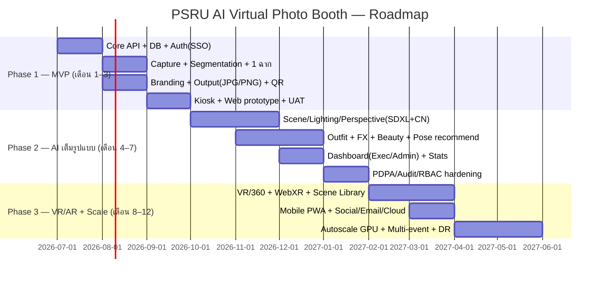
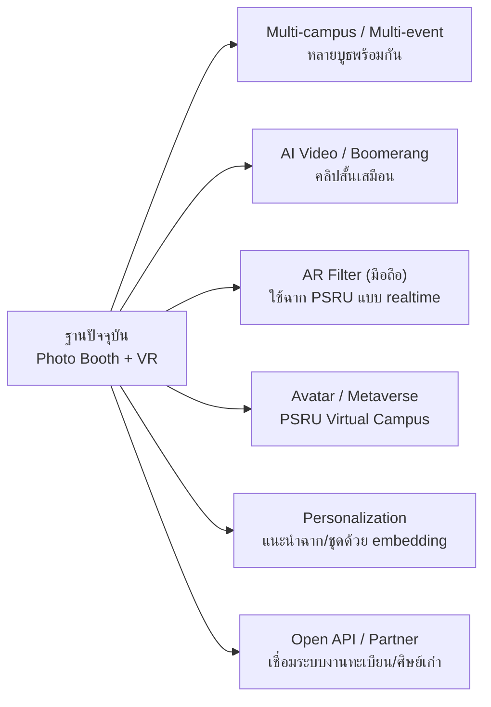

# 10. Implementation Roadmap · KPI · Maintenance & Scaling

## 10.1 Implementation Roadmap (Phase 1–3)

### Phase 1 — MVP / Proof of Value (เดือน 1–3)
- **เป้าหมาย:** ใช้งานจริงในงานเล็กได้ — ถ่าย → แยกพื้นหลัง → ฉากพื้นฐาน → branding → QR ดาวน์โหลด
- **ส่ง:** Core API, PostgreSQL, SSO, Segmentation (SAM2/MediaPipe), 3–5 ฉาก, Kiosk + Web, Consent/PDPA พื้นฐาน

### Phase 2 — AI เต็มรูปแบบ (เดือน 4–7)
- **เป้าหมาย:** คุณภาพระดับสตูดิโอ — Generative scene + relighting + perspective + outfit + beauty + FX
- **ส่ง:** SDXL+ControlNet pipeline, Triton serving, แนะนำท่าทาง/ฉาก, Executive & Admin Dashboard, RBAC/Audit เต็ม

### Phase 3 — VR/AR + Scale (เดือน 8–12)
- **เป้าหมาย:** VR/360, Mobile PWA, ช่องทาง output ครบ, รองรับอีเวนต์ใหญ่ + DR
- **ส่ง:** WebXR/OpenXR, VR Scene Library, autoscale GPU (KEDA + spot), multi-event, DR/backup test

## 10.2 KPI & ตัวชี้วัดความสำเร็จ

| มิติ | KPI | เป้าหมาย |
|------|-----|----------|
| ประสบการณ์ | เวลาเรนเดอร์เฉลี่ย (ภาพเดี่ยว) | ≤ 12 วินาที |
| ประสบการณ์ | เวลารวมต่อรอบใช้งาน (capture→ดาวน์โหลด) | ≤ 60 วินาที |
| คุณภาพ | คะแนนความพึงพอใจเฉลี่ย | ≥ 4.3 / 5 |
| คุณภาพ | อัตรา re-render/เรนเดอร์ใหม่ | ≤ 8% |
| การใช้งาน | จำนวนภาพ/อีเวนต์ | ตามเป้าแต่ละงาน |
| การใช้งาน | อัตราดาวน์โหลด/แชร์ต่อภาพ | ≥ 70% |
| ความเสถียร | Uptime ระบบ (ช่วงงาน) | ≥ 99.5% |
| ความเสถียร | Job failure rate | ≤ 2% |
| ความปลอดภัย | Consent completion ก่อนเก็บข้อมูล | 100% |
| ความปลอดภัย | เหตุละเมิดข้อมูล | 0 |
| คุณค่าองค์กร | การเข้าถึงสื่อประชาสัมพันธ์ PSRU | เพิ่มขึ้น YoY |

> Dashboard แสดง: จำนวนผู้ใช้, จำนวนภาพ, ฉากยอดนิยม, เวลาใช้งาน, ดาวน์โหลด, ความพึงพอใจ,
> Heatmap การใช้งาน, รายงานผู้บริหาร (ดูต้นแบบใน `index.html`)

## 10.3 แผนบำรุงรักษา (Maintenance)

| รอบ | งาน |
|-----|-----|
| รายวัน (ช่วงงาน) | เฝ้าระวัง queue/GPU, ตรวจ failed jobs, สำรอง DB |
| รายสัปดาห์ | อัปเดต patch/CVE, ตรวจ log/alert, รีวิว audit |
| รายเดือน | ทบทวน KPI/cost, ปรับ prompt/ฉากตาม feedback, ทดสอบ restore |
| รายไตรมาส | DR drill, อัปเกรดโมเดล/ไลบรารี, pen-test, ทบทวน PDPA/นโยบาย |
| ก่อนอีเวนต์ใหญ่ | load test, เตรียม burst GPU, ซ้อม operator, freeze deploy |

- **Model lifecycle:** เวอร์ชันโมเดลใน `ai_prompts.model_ref`; ทดสอบ A/B ก่อน rollout; เก็บโมเดลเดิมไว้ rollback
- **Content/ฉาก:** เพิ่มฉาก/แบรนด์ผ่าน Admin Console โดยไม่ต้อง deploy ใหม่
- **Support:** runbook + on-call ช่วงอีเวนต์

## 10.4 แผนขยายระบบในอนาคต (Future Scaling)

- **แนวนอน:** เพิ่ม GPU node pool + KEDA รองรับหลายบูธ/หลายวิทยาเขตพร้อมกัน
- **ฟีเจอร์:** วิดีโอ AI สั้น, AR filter มือถือ, avatar/metaverse PSRU, แนะนำเฉพาะบุคคล
- **บูรณาการ:** เชื่อมระบบทะเบียน/ศิษย์เก่า/ประชาสัมพันธ์ ผ่าน Open API
- **Sustainability:** ใช้ GPU แบบ scale-to-zero + spot ลดต้นทุน/พลังงาน, รายงาน carbon ของการเรนเดอร์
