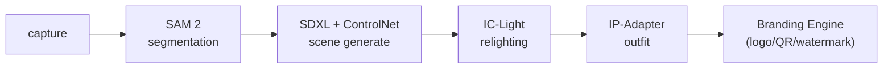

# 11. Phase 2 — Real AI Pipeline (pluggable backends)

Phase 2 replaces the mock render with real models behind a **pluggable AI backend**
(`backend/app/ai/`). The orchestrator (`app/pipeline.py`) and WebSocket progress are
unchanged — only the backend swaps.

## 11.1 Backends

| `AI_BACKEND` | ทำอะไร | ต้องมี | GPU |
|--------------|--------|--------|:---:|
| `mock` (default) | placeholder composite (gradient + subject) | — | ✗ |
| `cv` | **segmentation จริง** (OpenCV GrabCut) + composite ลงฉาก | `requirements-ai.txt` (opencv, numpy) | ✗ |
| `triton` | SAM 2 → SDXL+ControlNet → IC-Light → IP-Adapter | Triton + โมเดล + `tritonclient` | ✓ |

```bash
# CPU จริง (ไม่ต้องมี GPU)
pip install -r requirements-ai.txt
AI_BACKEND=cv uvicorn app.main:app

# GPU จริงผ่าน Triton
AI_BACKEND=triton TRITON_URL=triton:8000 uvicorn app.main:app
```

## 11.2 Stage → Model mapping (`triton` backend)



ใน `app/ai/triton.py` เติม input/output tensor names ของโมเดลที่ export แล้วใน
`_segment / _generate_scene / _relight / _outfit` (ชื่อโมเดลตั้งใน config:
`TRITON_SEG_MODEL`, `TRITON_SCENE_MODEL`, `TRITON_RELIGHT_MODEL`, `TRITON_OUTFIT_MODEL`)

## 11.3 Deploy Triton (สรุป)

1. Export โมเดลเป็นรูปแบบที่ Triton รองรับ (TensorRT/ONNX/PyTorch) วางใน model repository:
   ```
   models/
     sam2/            config.pbtxt  1/model.onnx
     sdxl_controlnet/ config.pbtxt  1/...
     ic_light/ ...    ip_adapter/ ...
   ```
2. รัน Triton (GPU):
   ```bash
   docker run --gpus all -p 8000:8000 -p 8001:8001 -p 8002:8002 \
     -v $PWD/models:/models nvcr.io/nvidia/tritonserver:24.10-py3 \
     tritonserver --model-repository=/models
   ```
3. ตั้ง `AI_BACKEND=triton`, `TRITON_URL=<host>:8000` ในฝั่ง API
4. ใช้ `fp16`/TensorRT + dynamic batching ใน `config.pbtxt` เพื่อ throughput (ดู `docs/04`, `docs/07`)

## 11.4 Performance / Scale

- backend.render รันผ่าน `asyncio.to_thread(...)` → ไม่บล็อก event loop ของ API
- ใช้ **Celery + Redis** เป็น queue จริง (broker มีใน compose แล้ว) + เปลี่ยน WS hub →
  Redis pub/sub สำหรับ worker หลายตัว → **ขั้นถัดไปของ Phase 2**
- Autoscale GPU worker ตาม queue depth (KEDA) — ดู `docs/07`

## 11.5 สถานะ

- ✅ ชั้น AI backend (mock/cv/triton) + refactor pipeline + branding overlay
- ✅ `cv` backend: segmentation + compositing จริงบน CPU (ทดสอบแล้ว)
- ✅ `triton` backend: โครงโค้ดเรียกโมเดลจริง (เติม tensor names ต่อ)
- ⏳ Celery/Redis worker + Redis pub/sub (ขั้นต่อไป)
- ⏳ ฟอนต์ไทยใน Branding Engine (ข้อความไทยในภาพ)
